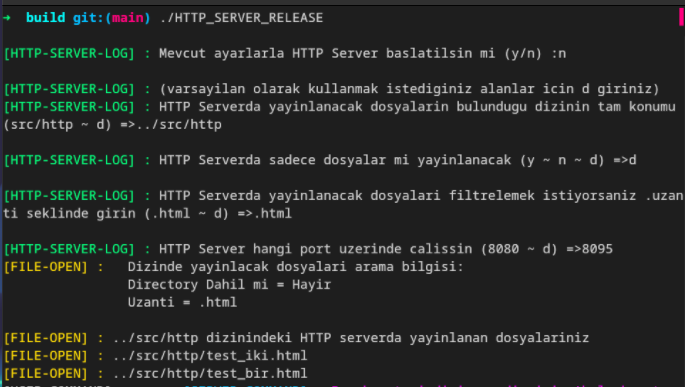
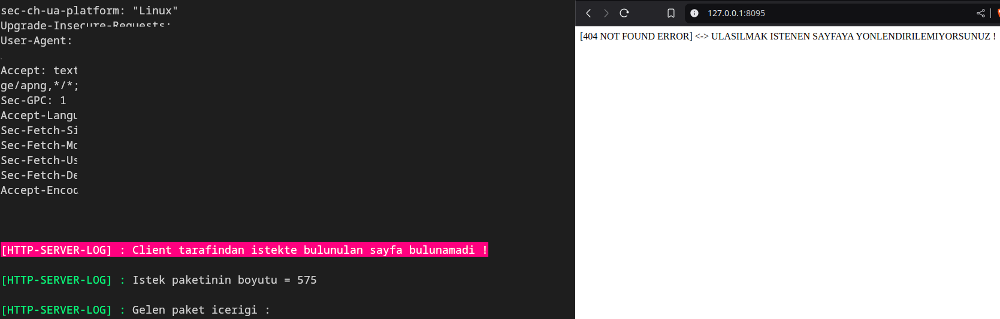
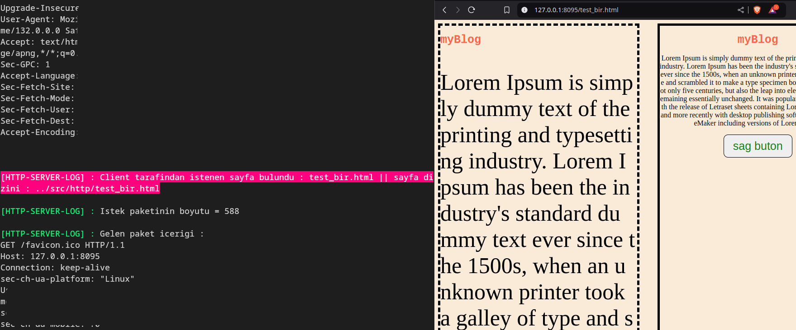
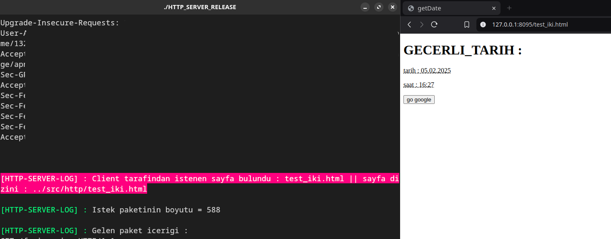
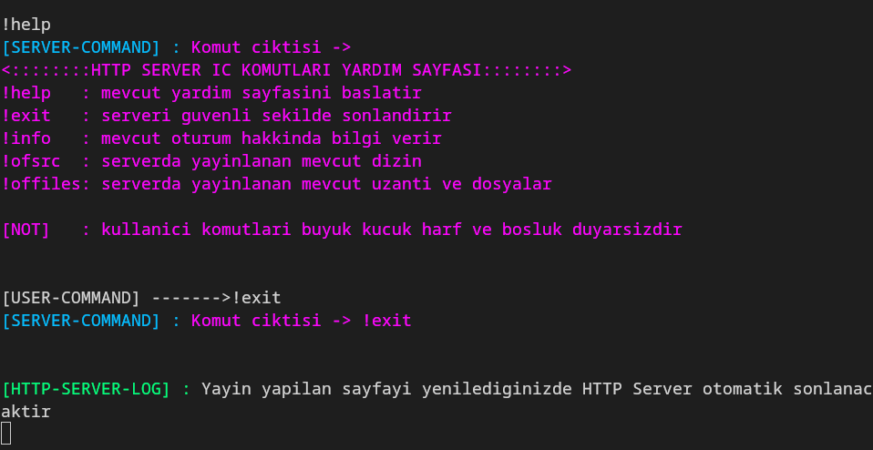

# basic-HTTP1.1-Server
  
  + Boost::Asio kullanilarak oluşturulmuş ,herhangi ağır bir üçüncü
    parti yazılım kurmadan web projelerini LAN üzerinde çalıştırmaya imkan tanıyan
    basit bir HTTP server

### basic-HTTP1.1-Server Algoritması

  + Program başlangıcında verilen dizinde belirli bir uzantı türüne göre
    filtreleyerek/filtrelemeyerek dizindeki tüm dosyaların pathlerini bir
    vektörde tutuyor bu işlemi filestream kullanarak yaptığımızdan dolayı C++17
    standartı kullanılmak zorunda kalındı
  
  + Dizindeki mevcut dosyalarının pathleri üzerinden sırayla okuma yapılarak
    ikinci bir vektör içerisinde dosya içerikleri tutuldu , her okuma sırasında
    okunan dosyanın pathi üzerinden adı parse edilerek bir unordered mapte saklandı ve
    vektörün hangi sırasına hangi dosyanın içeriğinin yerleştirildiği kayıt altına alındı
    
 +  Server gelen client isteğine göre aşağıdaki paketle yanıt gönderecek şekilde yazıldı
    [MDN Response](https://developer.mozilla.org/en-US/docs/Glossary/Response_header)
    ~~~
    STATUS          => HTTP/1.1 200 OK\r\n
    TYPE            => Content-Type: text/plain\r\n
    LENGTH          => Content-Length: 15\r\n
    HEAD/BODY AYRIM => \r\n
    DATA            => "hello world !"
    ~~~

+  Gönderilen paketteki DATA alanı vektörlerde sakladığım dosya içeriği eklenerek gönderildi
   bunun içinde gelen istek paketi alınıp paketin başındaki istenen sayfa kısmı parse edildi

+  Örnek istek paketi [MDN Request](https://developer.mozilla.org/en-US/docs/Glossary/Request_header)
    ~~~
    [HTTP-SERVER-LOG] : Gelen paket icerigi : //servera gelen örnek istek paketi
    GET /test_iki.html HTTP/1.1                
    Host: 127.0.0.1:8095                          
    .
    .
    ~~~
    gelen istek paketinin içeriğini parse edip kullanıcının gitmek istediği sayfayı çektikten sonra
    bu sayfanın vektörde hangi indexte tutulduğunu bulmak için fileOpen classında oluşturduğumuz
    unordered mape baktık daha sonrasında response paketimizin DATA kısmına vektörün o indexindeki
    dosya içeriğini ekleyip kullanıcıya gönderdik eğer mapte aranan dosya adını bulamadıysakta 404
    hatası gönderdik böylece yönlendirme işlemleri halledildi

## Screenshot

### Server manuel başlatma

##

### Geçersiz bir sayfa kullanıldı

##

### src/http/test_bir.html dosyası URL kısmına girildi

## 

###  src/http/test_iki.html dosyası URL kısmına girildi

##

### Konsol işlemleri
##### konsol işlemleri main threadde çalışırken Http server yeni bir threadde çalıştırılıyor
##### böylece kullanıcı komut girdiğinde server dinlemeye ve istekleri kabul etmeye devam edebiliyor

